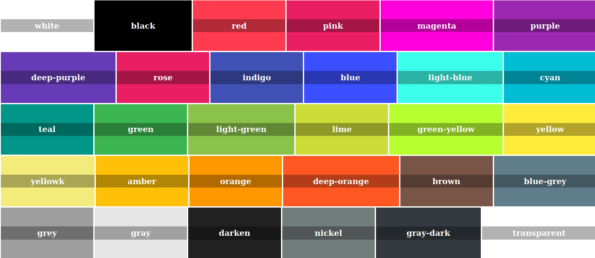

# Colors


Colorea tu mundo


Esto es un simple pero potente archivo css con múltiples clases para colorear con facilidad tus paginas web, tiene eventos, y además añade los colores de las principales marcas de redes sociales entre otros

## Uso

Su uso es muy sencillo solo descargue, añada y use.

Descargue

```Shell
git clone https://github.com/REP98/Colors.git
```

```Shell
npm i @rep985/colors
```

Añade

```Html
<!-- CDN -->
<!-- Combinado -->
<link rel="stylesheet" href="https://cdn.jsdelivr.net/combine/npm/@rep985/colors@0.2.0/dist/css/brands.min.css,npm/@rep985/colors@0.1.1/dist/css/color.min.css">

<link rel="stylesheet" href="https://cdn.jsdelivr.net/npm/@rep985/colors@0.2.0/dist/css/brands.min.css"> <!-- Clases de Colores -->
<link rel="stylesheet" href="https://cdn.jsdelivr.net/npm/@rep985/colors@0.2.0/dist/css/color.min.css"> <!-- Clases para marcas -->
<!-- O local -->
<link rel="stylesheet" href="path/Colors/dist/css/color.css"> <!-- Clases de Colores -->
<link rel="stylesheet" href="path/Colors/dist/css/brands.css"> <!-- Clases para marcas -->
```

Use

```Html
<div class="bg-magenta">...</div>
<button class="bg-blue bg-blue-hover-d2 fg-white-d2 fg-white-hover">Click</button>
```

## Sass

Ya que esta escrito en Sass y compilado a CSS puede usar el Sass y añadir sus propios colores para ampliar o modificar su archivos

### Añadir y/o modificar

Se ofrece 4 variables Sass para añadir o modificar los colores

#### Colores

Se dispone de una Variable `$color` que es un mapa scss

```Scss
@use "sass:map";
// Esto modificara el color rojo
$color: map.merge(("red": #f22), $color); 
// Esto añade el color pinklight
$color: map.merge(("pinklight": #f08bc4), $color);
```

De igual manera puede hacerlos con las siguientes variables

``` Scss
$theme-colors: () !default; // Para los Temas de colores
$theme-gradient-colors: () !default; // Para los Temas de degradados
$brands: () !default; // Para las Marcas
```

#### Configuración

Se añadieron Variables para la compilación permitiendo que decida que desea compilar y que no.

```Scss
$enable-scroll: true; 		// Indica si se crean clases para el Scrolling
$enable-theme: true; 		// Indica si se crean clases para el tema útil si se usa otro framework
$enable-gradients: true; 	// Indica si se crean las clases de degradado
$enable-brands: true; 		// Indican si se generan los colores de las marcas.
```

### Compilación

Ejecute en su terminal lo siguiente

```Shell
npm i
npm run css
```

## Demo

Si desea conocer todos los Colores visite [Nuestro Demo](https://rep98.github.io/Colors)
